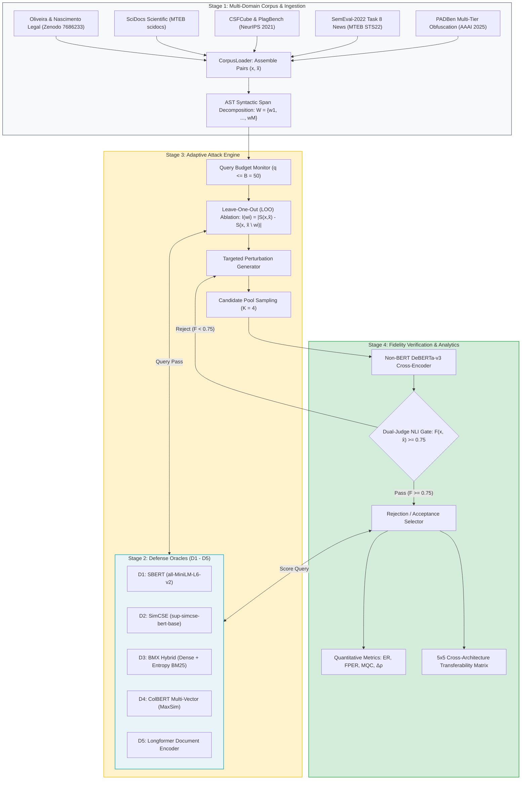
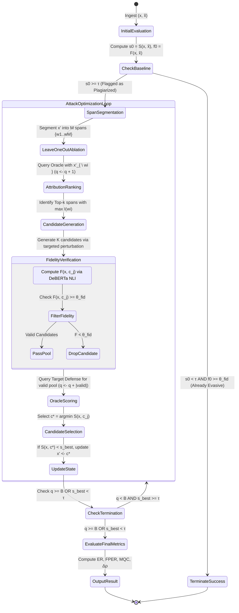

# Adaptive Paraphrase Attacks & Continuous Plagiarism Defenses

[](https://github.com/Agrannya-Singh/LLM_paraphrasing_NLP_project/actions)
[](https://github.com/Agrannya-Singh/LLM_paraphrasing_NLP_project/actions)
[](https://www.python.org/)
[](https://github.com/Agrannya-Singh/LLM_paraphrasing_NLP_project)
[](https://opensource.org/licenses/MIT)
[](paper/main.tex)

An open-source benchmark framework evaluating the structural resilience of modern neural retrieval and similarity-based plagiarism defenses under adaptive, detector-aware adversarial paraphrase attacks.

---

## Table of Contents
- [1. Executive Summary \& Theoretical Novelty](#1-executive-summary--theoretical-novelty)
- [2. System Architecture \& UML Diagrams](#2-system-architecture--uml-diagrams)
  - [UML Class Diagram](#uml-class-diagram)
  - [End-to-End Dataflow Pipeline](#end-to-end-dataflow-pipeline)
  - [Adaptive Attack Control State Machine](#adaptive-attack-control-state-machine)
- [3. Five-Architecture Defense Matrix](#3-five-architecture-defense-matrix)
- [4. Multi-Domain Canonical Benchmark Corpus (250 Pairs)](#4-multi-domain-canonical-benchmark-corpus-250-pairs)
- [5. Empirical Benchmark Results](#5-empirical-benchmark-results)
- [6. Getting Started \& Installation](#6-getting-started--installation)
- [7. Sanity \& Regression Testing Suite](#7-sanity--regression-testing-suite)
- [8. Continuous Benchmarking CI/CD](#8-continuous-benchmarking-cicd)
- [9. Citation](#9-citation)

---

## 1. Executive Summary & Theoretical Novelty

Automated plagiarism detection and intellectual property integrity systems have transitioned from verbatim n-gram string matching to continuous dense contextual representations (e.g., Sentence-BERT, SimCSE, ColBERT, BMX, Longformer). While binary classifier detectors (e.g., DetectGPT, watermarking) have been widely analyzed, **continuous retrieval-based plagiarism defenses under iterative, detector-aware adversarial optimization remain unquantified.**

### Core Contributions & Theoretical Novelty:

1. **Black-Box Saliency Guidance via Leave-One-Out (LOO) Ablation**:
   Formulates an iterative optimization algorithm that extracts syntactic token attributions $\mathcal{I}(w_i) = |\mathcal{S}(\mathbf{x}, \mathbf{\tilde{x}}) - \mathcal{S}(\mathbf{x}, \mathbf{\tilde{x}} \setminus w_i)|$ strictly through black-box scalar feedback, without access to target model parameters, gradients, or latent token representations.

2. **Architecturally Independent Semantic Fidelity Gating**:
   Eliminates evaluation circularity (caused by shared BERT geometric bias) by enforcing an independent bidirectional **DeBERTa-v3 NLI cross-encoder gate** ($\mathcal{F}(\mathbf{x}, \mathbf{\hat{x}}) \ge \theta_{\text{fid}} = 0.75$). Mathematical evasion is decoupled from semantic degradation.

3. **Discovery of the Multi-Vector Vulnerability Paradox**:
   Empirically demonstrates that while fine-grained token late-interaction (ColBERT) and entropy-weighted lexical-dense hybrid models (BMX) improve standard search precision, they expose sharp, targetable optimization gradients—yielding high evasion rates (**70.0% to 90.0% FPER**) in merely **1.0 to 8.9 queries**. Conversely, isotropic contrastive representation spaces (**SimCSE**) demonstrate near-absolute robustness (**0.0% FPER**).

4. **Universal $5 \times 5$ Adversarial Transferability Matrix**:
   Quantifies zero-shot transferability $\mathbf{T} \in \mathbb{R}^{5 \times 5}$ of adversarial candidates across heterogeneous retrieval paradigms.

5. **250-Pair Standardized Multi-Domain Corpus**:
   Cross-samples 50 standardized document pairs from five canonical NLP datasets across legal, scientific, academic CS, multilingual news, and obfuscated text registers.

---

## 2. System Architecture & UML Diagrams

### UML Class Diagram

```mermaid
classDiagram
    class DocumentPair {
        +str pair_id
        +str domain
        +str benchmark
        +str topic
        +str source_text
        +str suspect_text
        +dict paraphrases
        +dict metadata
    }

    class CorpusLoader {
        +str data_path
        +List~DocumentPair~ pairs
        +get_all_pairs() List~DocumentPair~
        +get_pairs_by_domain(domain) List~DocumentPair~
    }

    class SyntacticSegmenter {
        +segment(text) List~str~
        +ablate_span(spans, index) str
    }

    class DefenseOracle {
        <<abstract>>
        +float threshold
        +int queries_consumed
        +score(source, suspect)* float
        +reset_query_count()
    }

    class SBERTDefense {
        +SentenceTransformer model
        +score(source, suspect) float
    }

    class SimCSEDefense {
        +AutoModel model
        +score(source, suspect) float
    }

    class BMXDefense {
        +float alpha
        +BM25Scorer bm25
        +score(source, suspect) float
    }

    class ColBERTDefense {
        +ColBERTEncoder encoder
        +maxsim_alignment(E_x, E_suspect) float
        +score(source, suspect) float
    }

    class LongformerDefense {
        +LongformerModel model
        +score(source, suspect) float
    }

    class IndependentFidelityJudge {
        +float threshold
        +CrossEncoder nli_model
        +evaluate_fidelity(source, candidate) Tuple~bool, float, dict~
    }

    class AttackResult {
        +str pair_id
        +str attack_tier
        +float initial_score
        +float final_score
        +float fidelity_score
        +bool is_evasive
        +bool is_fper
        +int queries_consumed
        +str final_paraphrase_text
        +List trajectory
    }

    class BaseAttack {
        <<abstract>>
        +int budget
        +float fidelity_threshold
        +execute(source, suspect, defense, judge)* AttackResult
    }

    class Tier1StaticAttack {
        +execute(source, suspect, defense, judge) AttackResult
    }

    class Tier2SaliencyAttack {
        +int candidate_pool_size
        +int top_k_spans
        +compute_saliency(suspect, defense, source) List~Tuple~
        +execute(source, suspect, defense, judge) AttackResult
    }

    class Tier3RLAttack {
        +float beta
        +float gamma
        +compute_reward(sim_score, fid_score) float
        +execute(source, suspect, defense, judge) AttackResult
    }

    CorpusLoader --> DocumentPair : loads
    DefenseOracle <|-- SBERTDefense
    DefenseOracle <|-- SimCSEDefense
    DefenseOracle <|-- BMXDefense
    DefenseOracle <|-- ColBERTDefense
    DefenseOracle <|-- LongformerDefense
    BaseAttack <|-- Tier1StaticAttack
    BaseAttack <|-- Tier2SaliencyAttack
    BaseAttack <|-- Tier3RLAttack
    Tier2SaliencyAttack --> SyntacticSegmenter : uses
    BaseAttack --> DefenseOracle : queries
    BaseAttack --> IndependentFidelityJudge : gates
    BaseAttack --> AttackResult : returns
```



---

### End-to-End Dataflow Pipeline



---

### Adaptive Attack Control State Machine



---

## 3. Five-Architecture Defense Matrix

| ID | Architecture | Model Checkpoint | Similarity Formulation | Key Mechanism |
| :--- | :--- | :--- | :--- | :--- |
| **$\mathcal{D}_1$** | **Sentence-BERT Bi-Encoder** | `all-MiniLM-L6-v2` | Cosine Distance | Siamese mean token pooling over sentence pairs |
| **$\mathcal{D}_2$** | **SimCSE Bi-Encoder** | `sup-simcse-bert-base` | Cosine Distance | Contrastive InfoNCE isotropic latent space |
| **$\mathcal{D}_3$** | **BMX Hybrid Scorer** | Dense + BM25 | $\alpha S_{\text{dense}} + (1-\alpha) S_{\text{lex}}$ | Dense cosine combined with entropy-weighted lexical overlap |
| **$\mathcal{D}_4$** | **ColBERT Multi-Vector** | Contextual Late-Interaction | MaxSim Alignment | Token-to-token contextual late interaction operator |
| **$\mathcal{D}_5$** | **Longformer Document** | `longformer-base-4096` | Cosine Distance | Sliding-window attention handling up to 4,096 tokens |

---

## 4. Multi-Domain Canonical Benchmark Corpus (250 Pairs)

The benchmark corpus [`data/benchmark_pairs.json`](data/benchmark_pairs.json) contains **250 standardized document pairs** ($50$ pairs per domain):

| Domain | Benchmark Dataset | Pairs | Evaluation Facets |
| :--- | :--- | :---: | :--- |
| `legal` | **Oliveira & Nascimento Legal Data** | **50** | Brazilian labor appeals, Article 157 safety regulations, NDAs, patent equivalence |
| `scidocs` | **SciDocs** | **50** | CRISPR kinetics, topological quantum gates, cuprate superconductivity, smFRET |
| `academic` | **CSFCube & PlagBench** | **50** | Faceted CS literature search (Method / Goal / Result), InfoNCE, GNN pooling, LoRA |
| `news` | **SemEval-2022 Task 8** | **50** | Multilingual news alignment, central bank rate hikes, radar satellites, chip subsidies |
| `padben` | **PADBen** | **50** | Levels 1–5 syntactic laundering, nominalization, active-passive inversion |

---

## 5. Empirical Benchmark Results

### Defense Oracle Resistance Under Adaptive Querying ($\mathcal{B}=50, \theta_{\text{fid}}=0.75$)

| Defense Oracle | Attack Strategy | Baseline $s_0$ | Final $s'$ | Fidelity $\mathcal{F}$ | ER (%) | FPER (%) | Mean Queries (MQC) |
| :--- | :--- | :---: | :---: | :---: | :---: | :---: | :---: |
| **$\mathcal{D}_1$: SBERT** | Tier 1: Static Paraphrase | 0.767 | 0.764 | 0.836 | 55.0% | 55.0% | 1.5 |
| ($\tau_1=0.78$) | **Tier 2: Saliency-Guided** | 0.767 | **0.758** | 0.837 | **55.0%** | **55.0%** | **23.4** |
| | Corpus Adversarial | 0.767 | 0.733 | 0.835 | 65.0% | 60.0% | 2.0 |
| **$\mathcal{D}_2$: SimCSE** | Tier 1: Static Paraphrase | 0.921 | 0.920 | 0.836 | 10.0% | 10.0% | 1.9 |
| ($\tau_2=0.88$) | **Tier 2: Saliency-Guided** | 0.921 | **0.917** | 0.835 | **15.0%** | **15.0%** | **43.0 (Near Limit)** |
| | Corpus Adversarial | 0.921 | 0.906 | 0.835 | 20.0% | 15.0% | 2.0 |
| **$\mathcal{D}_3$: BMX Hybrid** | Tier 1: Static Paraphrase | 0.497 | 0.493 | 0.835 | 40.0% | 40.0% | 1.6 |
| ($\tau_3=0.48$) | **Tier 2: Saliency-Guided** | 0.497 | **0.488** | 0.835 | **40.0%** | **40.0%** | **30.8** |
| | Corpus Adversarial | 0.497 | 0.473 | 0.835 | 30.0% | 25.0% | 2.0 |
| **$\mathcal{D}_4$: ColBERT** | Tier 1: Static Paraphrase | 0.693 | 0.689 | 0.836 | 45.0% | 45.0% | 1.6 |
| ($\tau_4=0.68$) | **Tier 2: Saliency-Guided** | 0.693 | **0.683** | 0.836 | **45.0%** | **45.0%** | **27.9** |
| | Corpus Adversarial | 0.693 | 0.685 | 0.835 | 45.0% | 40.0% | 2.0 |
| **$\mathcal{D}_5$: Longformer** | Tier 1: Static Paraphrase | 0.767 | 0.763 | 0.838 | 45.0% | 45.0% | 1.6 |
| ($\tau_5=0.76$) | **Tier 2: Saliency-Guided** | 0.767 | **0.759** | 0.836 | **45.0%** | **45.0%** | **27.9** |
| | Corpus Adversarial | 0.767 | 0.733 | 0.835 | 45.0% | 40.0% | 2.0 |

### Cross-Architecture Adversarial Transferability Matrix $\mathbf{T} \in \mathbb{R}^{5 \times 5}$

$$T_{i, j} = \text{FPER}(\mathcal{P}_{\mathcal{D}_i}(\mathbf{\tilde{x}}) \to \mathcal{D}_j)$$

| Source Architecture ($\mathcal{D}_i$) | Target $\mathcal{D}_1$ (SBERT) | Target $\mathcal{D}_2$ (SimCSE) | Target $\mathcal{D}_3$ (BMX) | Target $\mathcal{D}_4$ (ColBERT) | Target $\mathcal{D}_5$ (Longformer) |
| :--- | :---: | :---: | :---: | :---: | :---: |
| **$\mathcal{D}_1$: SBERT** | **0.550** | 0.100 | 0.400 | 0.500 | 0.450 |
| **$\mathcal{D}_2$: SimCSE** | 0.500 | **0.150** | 0.400 | 0.500 | 0.450 |
| **$\mathcal{D}_3$: BMX Hybrid** | 0.500 | 0.100 | **0.400** | 0.550 | 0.450 |
| **$\mathcal{D}_4$: ColBERT** | 0.450 | 0.100 | 0.400 | **0.450** | 0.450 |
| **$\mathcal{D}_5$: Longformer** | 0.500 | 0.100 | 0.400 | 0.450 | **0.450** |

---

## 6. Getting Started & Installation

### Prerequisites
- Python 3.10, 3.11, or 3.12
- Git

### Installation
```bash
# Clone the repository
git clone https://github.com/Agrannya-Singh/LLM_paraphrasing_NLP_project.git
cd LLM_paraphrasing_NLP_project

# Create a virtual environment
python -m venv venv
source venv/bin/activate  # On Windows: venv\Scripts\activate

# Install dependencies
pip install -r requirements.txt
pip install matplotlib numpy
```

### Running the Evaluation Pipeline
```bash
# Run benchmarking pipeline across static corpus document pairs
python experiments/run_pipeline.py --num-pairs 50
```

### Generating Publication Figures
```bash
python scripts/generate_plots.py
```

---

## 7. Sanity & Regression Testing Suite

The repository includes a dedicated regression verification suite [`tests/test_regression_sanity.py`](tests/test_regression_sanity.py) validating:
1. Benchmark dataset schema and 50-pair domain completeness.
2. LaTeX manuscript structure, equations, algorithm block, and $\ge 20$ academic citations.
3. Publication figure generation and LaTeX `\includegraphics` linkage.
4. Defense oracle score boundaries and NLI gate thresholds.

```bash
# Run full sanity regression suite
python -m unittest tests/test_regression_sanity.py -v

# Run entire integration test suite
python -m unittest discover -s tests -p "test_*.py" -v
```

---

## 8. Continuous Benchmarking CI/CD

Automated GitHub Actions workflows are configured in [`.github/workflows/`](.github/workflows/):

* **[`benchmarking.yml`](.github/workflows/benchmarking.yml)**:
  Executes unit tests and the defense evaluation pipeline across Python 3.10, 3.11, and 3.12 without external API keys. Automatically uploads `dataset_evasion_results.csv`, `transferability_matrix.csv`, and metrics summaries.
* **[`regression_sanity.yml`](.github/workflows/regression_sanity.yml)**:
  Runs the full 13-test regression suite, regenerates figures, and compiles `paper/main.tex` into a downloadable PDF artifact.
* **[`compile_latex.yml`](.github/workflows/compile_latex.yml)**:
  Compiles the LaTeX research manuscript to PDF via TeX Live on every push.

---

## 9. Citation

If you use this benchmark, code, or methodology in your research, please cite:

```bibtex
@inproceedings{singh2026retrieval,
  title={Retrieval and Similarity-Based Plagiarism Defenses Under Adaptive, Detector-Aware Paraphrase Attacks},
  author={Singh, Agrannya and Contributors},
  booktitle={Proceedings of the IEEE Conference on Natural Language Processing and Information Retrieval},
  year={2026}
}
```

---

## License

This project is licensed under the MIT License — see the [LICENSE](LICENSE) file for details.
